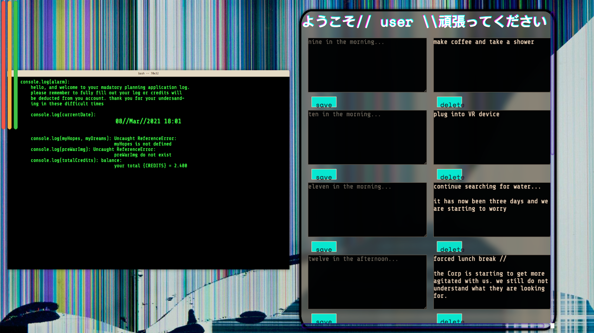

# daily-planner
A web app to plan daily activities throughout the week inspired by watching Akira and The Matrix in the past couple of days. 



On the JavaScript side of the project we are really making it all work with a single block of code utilizing local storage:
```
const nineSave = document.getElementById('nine-save')
const nineBtn = $('#nine-btn')
const nineDelete = $('#nine-delete')

nineBtn.click( () => {
    let nineTask = document.getElementById('nine-input').value;
    localStorage.setItem('nine-am-task', nineTask)
    renderNineTask();
});


function renderNineTask() {
    let nineData = localStorage.getItem('nine-am-task')
    nineSave.textContent = nineData
    $('#nine-save').removeClass('hide')
}

nineDelete.click( () => {
    let nineData = localStorage.getItem('nine-am-task')
    nineSave.textContent = ''
    localStorage.clear('nine-am-task')
})

renderNineTask();

```
I am essentially making a path from the text box on the right, to local storage, and then from local storage to the text box on the right. And everything is being kicked off by the "save" button.

This block of code is then altered to match each following div's attributes from 9am all the way to 5pm. 

# Future Work

I need to target my date to be able to change the color of my text fields, otherwise I am extremely happy with this project.

Working link: https://zane-gilfillan.github.io/daily-planner/